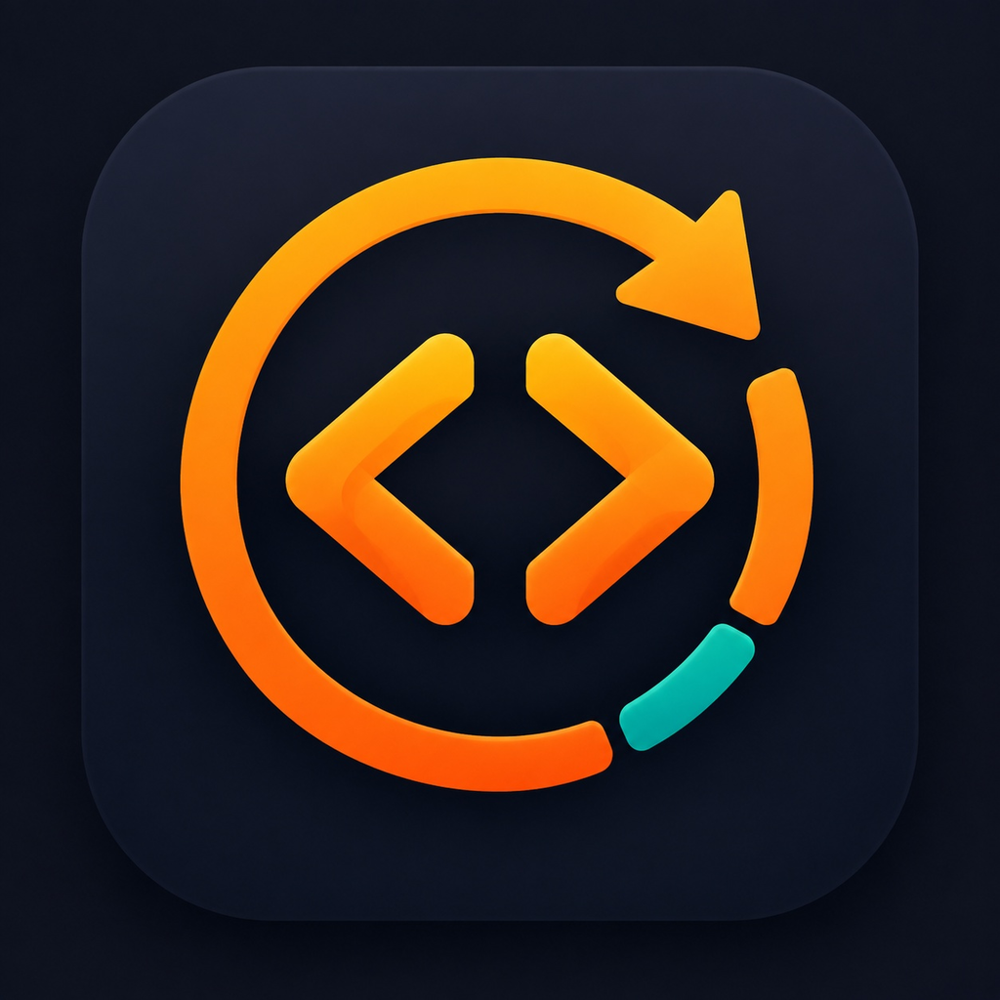

<div align="center">
  

  <h1>LeetCode FSRS</h1>

  <p>
    用间隔重复把做过的题变成长期记忆。<br>
    Turn solved problems into long-term memory with spaced repetition.
  </p>

  <p>
    <a href="#中文">中文</a> · <a href="#english">English</a>
  </p>

  <p>
    <a href="https://github.com/SaintFore/LeetCodeCLI/actions/workflows/test.yml"></a>
    
    <a href="https://aur.archlinux.org/packages/leetcode-fsrs-git"></a>
  </p>
</div>

---

<a id="中文"></a>

## 中文

LeetCode FSRS 是一个以 [Textual](https://textual.textualize.io/) TUI 为主、[Typer](https://typer.tiangolo.com/) CLI 为辅的 LeetCode 复习计划器。它使用官方 [`py-fsrs`](https://github.com/open-spaced-repetition/py-fsrs) 计算复习时间，把你的 Accepted 题目组织成每日计划。

### 为什么用它

- **到期优先**：每日默认最多 20 题，其中新题最多 5 题。
- **官方 FSRS**：使用 Again、Hard、Good 和 Easy 评分，不维护自制调度算法。
- **专注终端**：在 TUI 中浏览 Today、Questions、Stats、Data 和 Settings。
- **解题器可替换**：默认启动 `nvim +Leet`，也可配置任意本机命令。
- **多设备可恢复**：不可变事件可由 Syncthing、WebDAV 等工具复制；本地 SQLite 只是可重建索引。
- **中英文界面**：可在中文和英文 TUI 之间切换。

### 快速开始

需要 Python 3.11 或更高版本。

#### Arch Linux

```bash
paru -S leetcode-fsrs-git
```

#### 从源码安装

```bash
git clone https://github.com/SaintFore/LeetCodeCLI.git
cd LeetCodeCLI
python -m venv .venv
source .venv/bin/activate
pip install -e .
```

启动时不带子命令即会打开 TUI：

```bash
leetcode-fsrs
```

首次启动会引导你选择一个由外部工具同步的共享目录、固定的 IANA 时区，以及可选的 LeetCode 用户名。也可以无交互初始化：

```bash
leetcode-fsrs init ~/Sync/leetcode-fsrs \
  --timezone Asia/Shanghai \
  --username YOUR_NAME
```

### 导入 LeetCode Accepted

```bash
leetcode-fsrs auth login
leetcode-fsrs import-accepted
```

> [!IMPORTANT]
> `LEETCODE_SESSION` 只保存在当前设备的系统 keyring，不会写入共享目录。如果系统没有可用的 keyring，程序不会降级为明文存储；可在当前 shell 中设置 `LEETCODE_SESSION` 环境变量。

导入会缓存题目目录，并把新的 Accepted 题目加入复习。它不会伪造一次 FSRS 评分。

### 日常复习

1. 在 **Today** 中选择题目并打开解题器。
2. TUI 会暂停，等待外部解题进程退出。
3. 回到 TUI 后选择 Again、Hard、Good 或 Easy；不想评分时可跳过。

自定义解题器：

```bash
leetcode-fsrs config solver 'my-solver {slug} {url}'
```

解题进程还会收到 `LEETCODE_FSRS_KEY`、`LEETCODE_FSRS_SLUG` 和 `LEETCODE_FSRS_URL` 环境变量。

### TUI 键盘操作

| 按键 | 操作 |
| --- | --- |
| `h` / `l` | 切换到上一个 / 下一个标签页 |
| `j` / `k` | 在 Today 或 Questions 表格中下移 / 上移 |
| `g` / `G` | 跳到表格首行 / 末行 |
| `Enter` 或 `o` | 在 Today 打开当前题目的解题器 |
| `s` | 在 Today 跳过，或在 Questions 暂停当前题目 |
| `1` / `2` / `3` / `4` | 记录 Again / Hard / Good / Easy |
| `/` / `Esc` | 聚焦 Questions 搜索框 / 返回表格 |
| `e` / `u` | 在 Questions 加入复习 / 恢复当前题目 |
| `i` | 在 Data 导入 Accepted 题目 |
| `r` / `q` | 刷新数据 / 退出 |

输入框获得焦点时，字母键用于输入文字。方向键、Tab、按钮 Enter 操作和鼠标仍然可用；Footer 会显示当前页面可用的快捷键。

### CLI 速查

| 命令 | 用途 |
| --- | --- |
| `leetcode-fsrs` | 打开 TUI |
| `leetcode-fsrs today [--json]` | 查看到期优先的今日队列 |
| `leetcode-fsrs rate two-sum good` | 直接记录一次评分 |
| `leetcode-fsrs card enroll\|suspend\|resume QUESTION` | 管理题目状态 |
| `leetcode-fsrs config set daily_limit 20` | 修改可在设备间复制的学习偏好 |
| `leetcode-fsrs config set language en` | 将 TUI 语言切换为英文 |
| `leetcode-fsrs status` | 检查题库、投影和复制健康状态 |

运行 `leetcode-fsrs --help` 或任意子命令的 `--help` 查看完整参数。

### 多设备复制与数据安全

共享的 **Study Library** 是事实来源，只包含清单和按设备、UTC 日期分割的不可变事件：

```text
shared-directory/
├── library.json
└── events/
    ├── <device-a>/<UTC-day>.ndjson
    └── <device-b>/<UTC-day>.ndjson
```

每台设备保留自己的 SQLite **Projection** 和题目缓存。投影可以随时由事件重建，因此不需要、也不应被同步。

> [!WARNING]
> 只同步你在 `init` 时选择的共享目录。不要同步 XDG 配置、keyring、题目缓存或 `projection.sqlite3`，也不要把一台设备的配置文件复制到另一台设备。

更多细节见 [同步与恢复](docs/sync.md) 和 [架构](docs/architecture.md)。

> [!NOTE]
> 2.0 不会自动迁移旧版 JSON 数据；它会从新的事件库开始。

### 开发

```bash
python -m venv .venv
source .venv/bin/activate
pip install -e '.[test]'
./scripts/check.sh
```

统一入口依次运行 Ruff lint、Ruff 格式检查、Pyright、pytest 和隔离的 CLI smoke test，并在最后汇总所有失败项。

Arch Linux 打包配置位于 `packaging/aur-git/`；也可使用 `scripts/build_arch_package.sh` 调用 `paru` 进行本地构建。

---

<a id="english"></a>

## English

LeetCode FSRS is a LeetCode review planner with a [Textual](https://textual.textualize.io/) TUI and a [Typer](https://typer.tiangolo.com/) administration CLI. It uses the official [`py-fsrs`](https://github.com/open-spaced-repetition/py-fsrs) scheduler to turn your Accepted problems into a daily review plan.

### Why use it

- **Due first:** each daily plan contains up to 20 cards by default, including at most 5 new cards.
- **Official FSRS:** grade reviews with Again, Hard, Good, or Easy without relying on a custom scheduler.
- **Terminal focused:** browse Today, Questions, Stats, Data, and Settings from the TUI.
- **Replaceable solver:** launch `nvim +Leet` by default or configure any device-local command.
- **Recoverable across devices:** replicate immutable events with Syncthing, WebDAV, or another file-sync tool; local SQLite is only a rebuildable index.
- **Chinese and English UI:** switch the TUI language at any time.

### Quick start

Python 3.11 or newer is required.

#### Arch Linux

```bash
paru -S leetcode-fsrs-git
```

#### Install from source

```bash
git clone https://github.com/SaintFore/LeetCodeCLI.git
cd LeetCodeCLI
python -m venv .venv
source .venv/bin/activate
pip install -e .
```

Running the command without a subcommand opens the TUI:

```bash
leetcode-fsrs
```

On first launch, the setup screen asks for a shared directory managed by an external sync tool, a fixed IANA timezone, and an optional LeetCode username. You can also initialize without prompts:

```bash
leetcode-fsrs init ~/Sync/leetcode-fsrs \
  --timezone Asia/Shanghai \
  --username YOUR_NAME
```

### Import LeetCode Accepted problems

```bash
leetcode-fsrs auth login
leetcode-fsrs import-accepted
```

> [!IMPORTANT]
> `LEETCODE_SESSION` is stored only in the current device's system keyring and never enters the shared directory. If no usable keyring is available, the application will not fall back to plaintext storage; set `LEETCODE_SESSION` in the current shell instead.

An import caches the question catalog and enrolls newly Accepted problems. It never invents an FSRS review.

### Daily review workflow

1. Select a problem from **Today** and open the solver.
2. The TUI suspends while the external solver process runs.
3. After returning, choose Again, Hard, Good, or Easy—or skip without grading.

Configure a different solver with placeholders:

```bash
leetcode-fsrs config solver 'my-solver {slug} {url}'
```

The solver process also receives `LEETCODE_FSRS_KEY`, `LEETCODE_FSRS_SLUG`, and `LEETCODE_FSRS_URL` environment variables.

### TUI keyboard controls

| Key | Action |
| --- | --- |
| `h` / `l` | Switch to the previous / next tab |
| `j` / `k` | Move down / up in the Today or Questions table |
| `g` / `G` | Jump to the first / last table row |
| `Enter` or `o` | Open the selected solver from Today |
| `s` | Skip in Today, or suspend the selected question in Questions |
| `1` / `2` / `3` / `4` | Record Again / Hard / Good / Easy |
| `/` / `Esc` | Focus the Questions search / return to its table |
| `e` / `u` | Enroll / resume the selected question in Questions |
| `i` | Import Accepted problems from Data |
| `r` / `q` | Refresh data / quit |

Letter keys enter text while an input has focus. Arrow keys, Tab, Enter on buttons, and the mouse remain available; the Footer shows the shortcuts for the current page.

### CLI reference

| Command | Purpose |
| --- | --- |
| `leetcode-fsrs` | Open the TUI |
| `leetcode-fsrs today [--json]` | Show the due-first daily queue |
| `leetcode-fsrs rate two-sum good` | Record a rating directly |
| `leetcode-fsrs card enroll\|suspend\|resume QUESTION` | Manage card state |
| `leetcode-fsrs config set daily_limit 20` | Change a portable study preference |
| `leetcode-fsrs config set language zh` | Switch the TUI language to Chinese |
| `leetcode-fsrs status` | Inspect library, projection, and replication health |

Run `leetcode-fsrs --help` or add `--help` to any subcommand for the complete interface.

### Multi-device replication and data safety

The shared **Study Library** is the source of truth. It contains only a manifest and immutable events partitioned by device and UTC day:

```text
shared-directory/
├── library.json
└── events/
    ├── <device-a>/<UTC-day>.ndjson
    └── <device-b>/<UTC-day>.ndjson
```

Each device keeps its own SQLite **Projection** and question cache. The projection can always be rebuilt from events, so it does not need to be synchronized and must remain local.

> [!WARNING]
> Synchronize only the shared directory selected during `init`. Do not synchronize XDG configuration, the keyring, the question cache, or `projection.sqlite3`, and do not copy one device's configuration file to another device.

See [Study data replication](docs/sync.md) and [Architecture](docs/architecture.md) for the full design and recovery behavior.

> [!NOTE]
> Version 2.0 does not automatically migrate the legacy JSON data format; it starts with a new event library.

### Development

```bash
python -m venv .venv
source .venv/bin/activate
pip install -e '.[test]'
./scripts/check.sh
```

The unified entry point runs Ruff lint, Ruff formatting checks, Pyright, pytest, and an isolated CLI smoke test in order, then summarizes every failed stage.

The Arch Linux package lives in `packaging/aur-git/`. You can also build it locally through `scripts/build_arch_package.sh`, which invokes `paru`.
